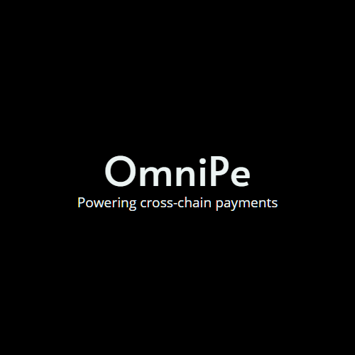

# OmniPe

<h1 align="center">

[](https://youtu.be/jxtqWJucd6k)

</h1>

## Inspiration

Payments is the most fundamental thing to every day life, almost every transaction with value is payments. Over the years there has been evolution in these payments systems to remove the friction when doing payments. With companies such as Visa and Mastercard taking charge best payment processors in the world they all face one problem they are non-censorship resistant yet they are a major backbone of payments but...

**Enter** Bitcoin - When Satoshi set out to build the Bitcoin protocol he envisioned a future where payments occur on the Bitcoin network ... But we all know that never hapenned instead it became the digital Gold.

**State of Crypto Payments today**
Most of crypto payments are fragmented each serving a particular chain or only accepting a particular chain. i.e SolanaPay for Solana, NearPay for Near and planthera of applications enabling payments across other chains.
None of these payments applications have achieved what has be done in traditional payments processors such as Visa and Mastercard.
All traditional payments processors use several moving parts such as TCP/IP and UDP as networking protocols, they also use currency exchanges to facilitate different forms of settlements. Until the past few years Crypto had no interoperability protocols that offer these messaging accross diffrerent chains.

## What OmniPe does.

Omnipe is a cross-chain payments aggragetor protocol that facilitates payments accross different chains easily without having to deploy various chains in a non-custodial manner. Merchants and receiving end users can receive payments with any type of Token as long as it has enough liquidity in the receiving chain. The Merchant can also choose what type of Token they'd like to settle in the destination chain.
With these you get the features offered by payment processors such as Visa where you can spend your Dollars in Europe without having to go through Exchanges to get Euros.

## How OmniPe does this.

Omnipe uses LayerZero as its messaging protocol to coordinate messages accross diffrent chains when a payment is done. It also uses Stargate as it liquidity protocol and Uniswap as it's exchage to perform swaps. Omnipe uses Chainlink Keepers for automation and gas savings by performing bridging of funds every 30 minutes.

| Layer             |         stake Holders          |
| ----------------- | :----------------------------: |
| Application Layer | payment providers(Stripe, etc) |
| Liquidity Layer   | Connext, Stargate, Multichain  |
| Messaging Layer   |    LayerZero, Nomad, Axelar    |
| Transport Layer   |        Stargate Routers        |
| Automation        |       Chainlink Keepers        |
| Exchange          |      Uniswap, Match, etc.      |


A merchant has to create an account on the Destination chain `Settler.sol` and enter the setlement token they'd like to settle in. They can then use their address as `userId` to receive payments on the source chains.

### Quick Demo

[OmniPe](https://omnipe.vercel.app/) Interface that allows merchants to create accounts on the Destination chain and receive payments on various Source chains.
[ KelBoards](https://kelboards.vercel.app/) A Keyboard marketplace that uses OmniPe as its payment processor.

## What's next for OmniPe: Cross-chain payments

For the next few months we will be working on a cross-chain payments protocol that will facilitate payments accross different chains Which include adding support for non-smart contracts chains such as Bitcoin, Zcash, Dogecoin, etc via Thorchain and Cataloge Finance we will be adding support for Solana and other non-EVM chains which will be the first to support truelly non-custodial cross-chain payments.

A new wallet interaction will be our top priority for the next few months.

We will be adding suport for new DeFi primitives such as Buy now Pay Never (BNPN) using yeild farming.

We aim to form strategic patnerships with payment providers such as stripe to be their technology providers.

<h1 align="center">
Build & Deployment
</h1>
## Deployed Addresses on Rinkeby

**Settler.sol :**
Mumbai
`0x4547f69beC77e5f00628357A010f67032D759bEd`
Rinkeby
`0x8321afEa88377D34D84C45362f701094B88be11a`

**Receiver.sol :**
Avalanche
`0xDAc24DcF66F570279d6a0B96cBdD593f918ef772`

#### Deploy All Contracts

Add Private key to .env file

```bash
cd contracts
./deploy.sh
```

#### Verify contracts

Replace addresses in `./contracts/verify.sh`

```bash
cd contracts
./verify.sh
```

#### Mint testnet compatible USDC

[Rinkeby](https://rinkeby.etherscan.io/address/0x1717A0D5C8705EE89A8aD6E808268D6A826C97A4#code)
[Avalanche](https://testnet.snowtrace.io/address/0x4A0D1092E9df255cf95D72834Ea9255132782318#code)

## Folder structure

```markdown
.
├── Backend
│   ├── services
│   └── tsconfig.json
├── Bankist
│   ├── bank-chekout
│   └── kelboards
├── Front-end
│   ├── omnipe-app
│   └── omnipe-landing-page
├── README.md
├── contracts
│   ├── FujiDeployArgs.js
│   ├── MumbaiDeployArgs.js
│   ├── README.md
│   ├── RinkebyDeployArgs.js
│   ├── artifacts
│   ├── cache
│   ├── constants
│   ├── contracts
│   ├── deploy-args.js
│   ├── deploy.sh
│   ├── hardhat.config.js
│   ├── node_modules
│   ├── package-lock.json
│   ├── package.json
│   ├── scripts
│   ├── test
│   ├── verify.sh
│   └── yarn.lock
└── images
├── omniPe.png
└── txanat.png
```
